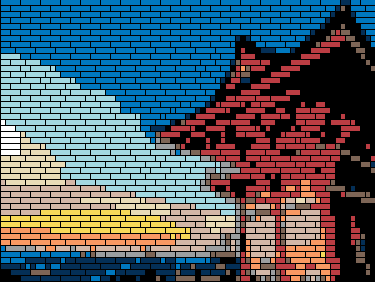

# lego-picture #

This application takes a jpeg image and coverts it to an image that could be constructed by stacking lego bricks.

## Build ##
```
mvn package
```

## Execute ##

### Single image
```
java -jar target/lego-pictures-jar-with-dependencies.jar --input inputFile.jpg --output outputFile.png --colors colorPalettes/lego.csv --width 75 
```

You can optionally add the `--preColorTransform` flag. Doing so will add an additional step to the generation process that transforms the colors before and after generating bricks instead of just after. Enabling it can sometimes give better results but is slower to run.
    
### Batch process
Use the process_files script to executing an image transform on all the images in a provided folder. Input arguments are:

* Path to folder containing source images
* Path to color palette CSV file
* The width of the output images in brick units

```
mvn package
./process_files.zsh ../sourceImageFolder colorPalettes/lego.csv 75
```

## Example




```
mvn package
java -jar target/lego-pictures-jar-with-dependencies.jar --input example/shrine.jpg --output example/shrine.png --colors example/shrineColors.csv --width 75 
```
### Outputs
* **example/shrine.png** - A visual picture of the lego-brick version
* **example/shrine.txt** - Metadata including the transform settings and various outputs of the bricks, colors and layouts needed to produce the image

### 3D Printed Build
* Use [https://github.com/cfinke/LEGO.scad](https://github.com/cfinke/LEGO.scad) to generate bricks of size 2x1, 2x2, 2x3, and 2x4
* 3D print bricks using [BambuLab X1C](https://us.store.bambulab.com/products/x1-carbon) printer and [BambuLab Matte PLA](https://us.store.bambulab.com/products/pla-matte-filament)